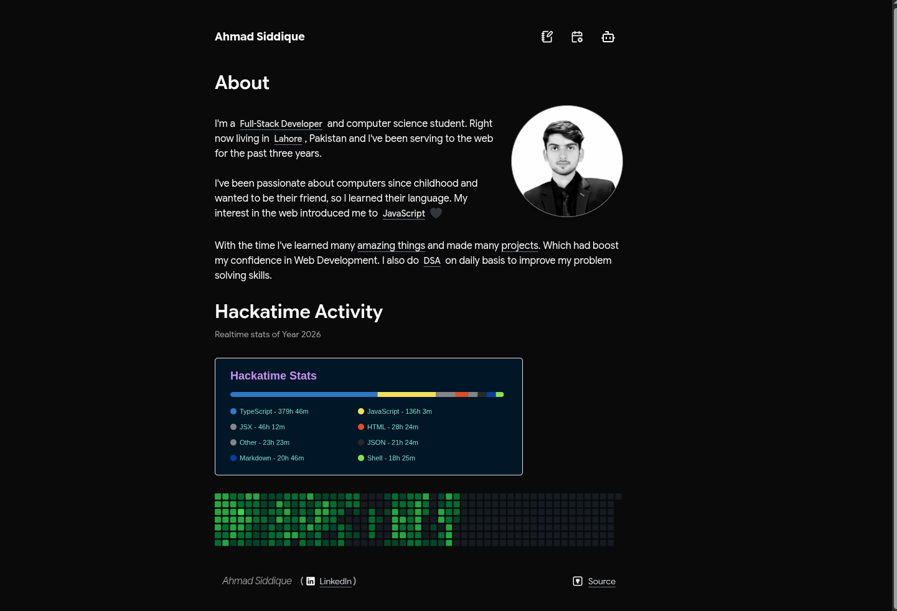

# My Portfolio
yes my portofolio not blog initially i wanted to solve the blogs problem of my portfolio but then I made my blog section too good that i wanted to redesign it my portofolio

> 


## Tech Stack
- **Nodejs**: It's a js runtime fyi
- **Express**: It's a framework if you know you know
- **Nextjs**: We know why we use Nextjs 
- **Sanity**: Content Operation Management
- **ClaudeSDK**: For AI operations
- **Tailwind**: Because I can't write CSS 
- **Shadcn UI**: UI library to make my life easy

## Installation
**git** must be installed on your system before proceding:

```bash
git clone https://github.com/ahmadsiddique-dev/blog.git
```

change directory
```bash
cd blog
```

Since this is a **Monorepo** so once it is installed then you can install packages

```bash
pnpm i
```

once dependencies are installed now its time to setup you **.env**

```bash
cd /app/rag
```

and make a **.env**

### windows
```bash
ni .env
```
### Linux/macos
```bash
touch .env
```

and paste

```bash
MONGODB_URI=mongodb_atlas_uri
# mongodb atlas is important because you need to enable atlas search which cannot do with local db

GOOGLE_API_KEY=get_it_from_ai_studio
# using embeding model of google
ANTHROPIC_API_KEY=anthropi_api_key
# response time of haiku is fast so that is why we are using claude
ORIGIN=http://localhost:3000
# in case of local development then later change it

DB_NAME=portfolio
COLLECTION_NAME=data
# you can keep them same so don't worry
```

now move to 

```bash
cd ../web
```

and make a **.env**

### windows
```bash
ni .env
```
### Linux/macos
```bash
touch .env
```

and paste

```bash
NEXT_PUBLIC_RAG_BACKEND_URL=http://localhost:7000
# in case of local development
```

>For Sanity you have to make your own sanity account and then if you run development server it sill ask you to make one you can follow and that's it


Run development server

```bash
cd ../..
pnpm run dev
```

Now you can go to

```bash
http://localhost:3000
http://localhost:3000/upload # secret route to upload pdf for rag
```

Sanity studio
```bash
http://localhost:3333
```

## How to contribute
Open a **PR** on repo and make me happy otherwise it's a great portfolio if you want to make content, write blogs and articals and change data frequently so you are good to go with it then.